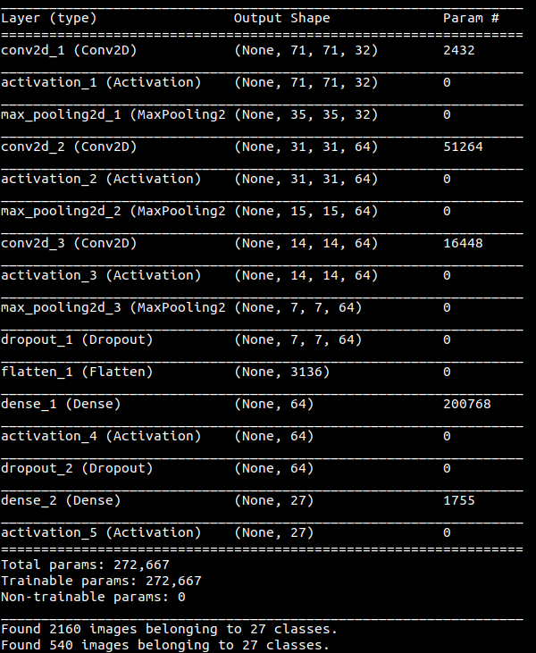
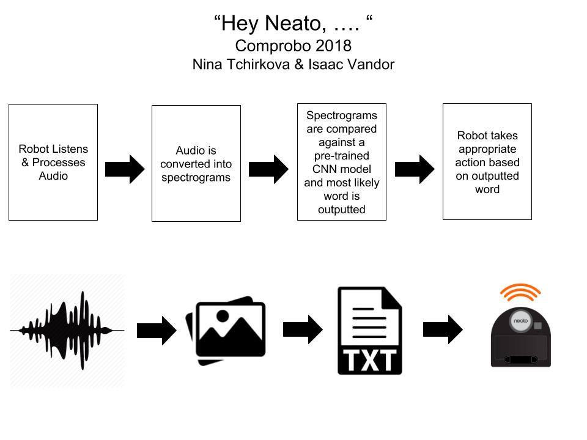

# Robot Learning
This is the repo for the comprobo robot learning project by Nina Tchirkova and Isaac Vandor 

## Project Goals
The goal of this project was to have a robot be able to "hear" a command and respond to it by doing a certain behavior. The way the robot would interpret the sound was by using a neural net that was trained on many sound files of people saying words. The GIF below shows the output of recording someone saying the word "down" and passing that into the neural net, which correctly identified the spoken word and outputted down to the robot command logic. 

## Implementation
To convert spoken keywords into useful robot commands, we recorded WAV files, converted them to spectrograms, and then compared live spectrograms against a pre-trained convolutional neural network which outputted the most likely keyword it detected and passed that keyword into the robot command logic. 

The convolutional neural network used was based on [this research work](https://static.googleusercontent.com/media/research.google.com/en//pubs/archive/43969.pdf) and consisted of a number of 2D convolutional layers, MaxPooling layers, and fully connected layers at the end. 

This diagram describes a convolutional neural network similar to the one we used for this project:

The results of training our model against the [Google WAVES Dataset](https://aiyprojects.withgoogle.com/open_speech_recording) are below:

Loss | Accuracy | Val_Loss | Val_Acc
--- | --- | --- | ---
.6006 | .8167 | .1198 | .9352

The precise implementation of the model as well as the parameter information (as given by model.summary()) is shown in the image below:

To collect test data, sound data is collected by connecting to a Raspberry Pi that is able to record audio. The continuous wav file is broken down into 1.5 seconds chunks at 0.1 second intervals. To minimize the amount of data to be processed, each chunk is condensed into an ogg file to see if it contains any sound. We chose this strategy because of the paper, *Speech Commands: A Dataset for Limited-Vocabulary Speech Recognition* by Pete Warden. If the ogg file is not silent, then a 1.5 second wav file is saved to a directory. All the wav files from this directory are converted into spectograms and passed through the neural net. Based on the word the neural net thinks is the wav file, the robot does a specific action.

## Design Decision
To model other natural language processing systems, we decided to work with a continuous stream of input. This meant that most of the sound we were recording was not even a word. This presented some extra challenges but we learned that using Python, it is possible to simultaneously read and write to the same file.

## Challenges
A major challenge we encountered was that our model was overfitting to the data set. This meant that every word was determined to be "bird". We were able to overcome this by better splitting the data into testing and validation sets as well as tweaking model parameters. However, we still did not come up with a model as reliably accurate as hoped.

## Future Work and Improvements
One obvious improvement would be to improve the accuracy of our model. This could be done by determining what features of the spectogram are the most important and then condensing the spectorgrams to where those are located. There could also be better preprocessing of wav files so that truly relevant spectrograms are processed. Additionally, the testing/validation split process currently pulls random spectrograms from each class, so there is the potential for overlap or picking similar spectrograms (i.e. spectrogram 434 is in the testing set and spectrogram 435 is in the validation set). Refining our process for splitting testing and training data as well as  better filtering the spectrograms should help improve the model. 

## Interesting Findings
Although probably not advisable, it is totally possible to read from a file that is also being written to at the same time. We took care so that the model always read from a part that was already written. Python truly is a beautiful language.
